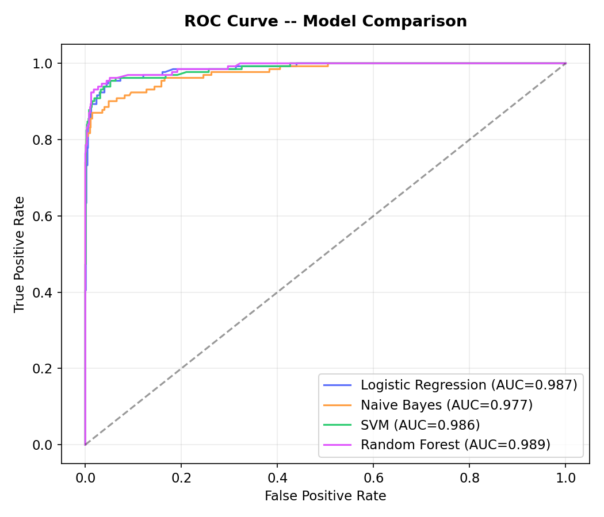
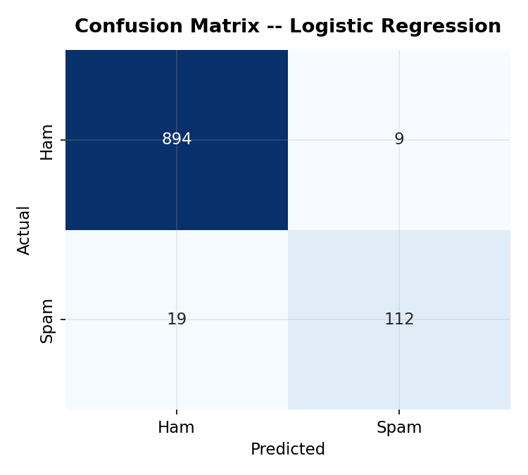
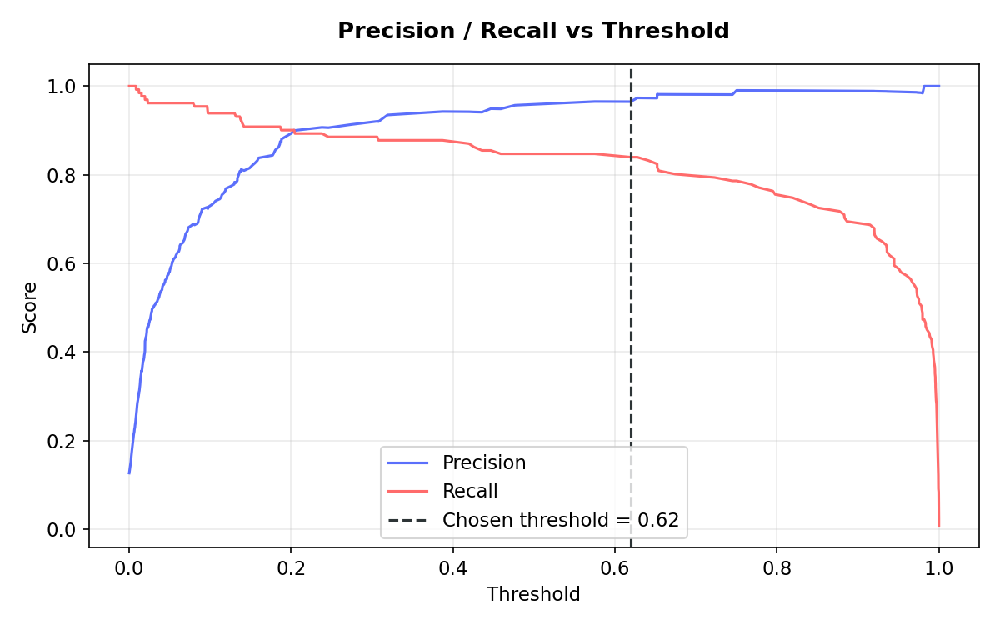

# Spam Detection — Probability-Based Classification with Cost-Optimal Threshold Selection

## Problem Overview

In real-world problems like spam detection, fraud detection, and risk modeling, datasets are often imbalanced, and accuracy alone is misleading. This project builds a binary classifier (Spam vs. Ham) for SMS messages, with the core design goal of **predicting probabilities and choosing a decision threshold justified by business cost**, rather than defaulting to 0.5 or picking a threshold by eyeballing a chart.

**The core question:** which model separates spam from ham best, and at what threshold should we act on its predictions — given that missing a spam message is more costly than a false alarm?

## Dataset

[SMS Spam Collection](https://www.kaggle.com/datasets/uciml/sms-spam-collection-dataset) — 5,572 labeled SMS messages.

- `v1` — label (`ham` / `spam`)
- `v2` — raw message text
- After removing 403 exact duplicate messages: **5,169 rows**, 13.4% spam / 86.6% ham (imbalanced — this is why accuracy alone is a poor metric here)

## Pipeline

1. **Preprocessing** — lowercase, strip punctuation, remove stopwords, TF-IDF vectorization (top 5,000 features). Uses `sklearn`'s built-in stopword list and a regex tokenizer instead of `nltk`, removing an external corpus-download dependency at runtime.
2. **Train/test split** — 80/20, stratified to preserve the spam/ham ratio in both sets.
3. **Model comparison** — four models, not one: Logistic Regression (`class_weight='balanced'`), Multinomial Naive Bayes (the classic text-classification baseline), Linear SVM (`LinearSVC`, wrapped in `CalibratedClassifierCV` for probability output since `LinearSVC` doesn't expose `predict_proba` natively — generally the strongest classical model for sparse TF-IDF features), and Random Forest (300 trees, `class_weight='balanced'`). Comparing multiple models — not just tuning one — is what tells you whether a result is actually good, not just plausible, and surfaces trade-offs a single model would hide.
4. **Model selection** — when ROC-AUC scores are within 0.005 of each other (effectively tied / noise-level), the tie is broken using F1 at the default threshold, since AUC measures ranking ability across *all* thresholds while F1 reflects performance at an actual operating point — the more relevant number for a model that will run in production at one threshold.
5. **Threshold selection** — instead of a hardcoded cutoff, thresholds from 0.01–0.99 are swept and scored by an explicit cost function:

   ```
   cost = (false positives × cost_of_flagging_real_message) + (false negatives × cost_of_missed_spam)
   ```

   **Cost assumption:** a false positive (a real message wrongly marked as spam) is assumed 3× costlier than a false negative (a spam message that slips into the inbox). This is the standard real-world framing for spam filters — a user may never check their spam folder, so a misflagged real message (a job offer, an OTP, a message from someone they know) can be genuinely missed, while a stray spam message in the inbox is just an annoyance. This is the *opposite* of the typical fraud-detection cost ratio (where missing fraud is usually worse than a false alarm) — worth noting explicitly, since the "right" cost direction depends entirely on the domain. The threshold that minimizes total cost is selected — not guessed. (Edit `COST_FALSE_POSITIVE` / `COST_FALSE_NEGATIVE` in the script to test a different assumption.)

## Results

| Model | Threshold | Precision (spam) | Recall (spam) | F1 (spam) | Accuracy | ROC-AUC |
|---|---|---|---|---|---|---|
| Logistic Regression | 0.50 | 0.919 | 0.870 | 0.894 | 0.974 | 0.987 |
| Naive Bayes | 0.50 | 0.990 | 0.756 | 0.857 | 0.968 | 0.975 |
| **SVM** | 0.50 | 0.957 | 0.855 | **0.903** | 0.977 | 0.987 |
| Random Forest | 0.50 | 0.971 | 0.779 | 0.864 | 0.969 | **0.990** |
| **SVM (cost-optimized)** | **0.64** | **0.982** | 0.832 | 0.901 | 0.977 | 0.987 |

**Random Forest has the best raw ROC-AUC (0.990)** — the best overall ranking ability of the four models — but like Naive Bayes, it's conservative at the default 0.5 threshold: high precision (0.971) but the second-weakest recall (0.779), so its F1 (0.864) trails behind SVM's.

**SVM remains the selected model** — it ties Logistic Regression and Random Forest at the top of ROC-AUC (all within 0.003, noise-level) but wins on F1 (0.903) and accuracy (0.977) at the default threshold. This is the clearest illustration in the whole project of why **ROC-AUC alone shouldn't decide model selection**: Random Forest "wins" on AUC, but would perform worse in production at a fixed operating threshold than SVM would.

**At SVM's cost-optimal threshold (0.64),** precision jumps from 95.7% → **98.2%** — only **2 real messages** out of 903 are wrongly flagged as spam, down from 5 at the default threshold — at the cost of recall dropping from 85.5% → 83.2% (a few more spam messages slip through, 22 vs 19). Given the cost assumption above, this is the right trade: a small increase in missed spam is a reasonable price for a large drop in real messages getting lost in the spam folder.





## Business Interpretation

- In spam filtering, a **false positive** (a real message wrongly flagged as spam) is generally more costly than a **false negative** (spam that slips into the inbox) — a misflagged real message can be genuinely missed if the user never checks their spam folder, while a stray spam message is just an annoyance. This justifies choosing precision-favoring thresholds over the default 0.5, as done here.
- The **cost ratio (3:1) is an assumption**, not a measured business figure — in a real deployment, this would come from actual support/complaint costs or user research, and the threshold would be re-derived from that number.
- **Model choice matters beyond raw accuracy**: Naive Bayes' high precision could look attractive at a glance, but its lower recall means more spam reaches users — the "better" model depends on which error the business cares about more.

## Reproducibility Note

Results can vary slightly (by ~1-2 percentage points, and the cost-optimal threshold by ~0.02) between runs. This is because `CalibratedClassifierCV` (used to get probability outputs from `LinearSVC` for the SVM model) performs its own internal train/validation splitting for probability calibration, and that split isn't currently seeded with a fixed `random_state`. The overall conclusions — SVM winning on F1, Random Forest having the best raw AUC, precision improving substantially at the cost-optimized threshold — are consistent across runs; only the exact decimal values shift slightly. Pinning a `random_state` inside `CalibratedClassifierCV` would make results fully deterministic, if needed.

## Project Structure

```
spam_project/
├── spam_detection.py       
├── spam.csv                 
├── class_distribution.png
├── confusion_matrix_logistic_regression.png
├── confusion_matrix_naive_bayes.png
├── precision_recall_vs_threshold.png
├── roc_curve.png
├── metrics_summary.csv
└── metrics_summary.md
└── README.md
```

## Run it

```bash
pip install -r requirements.txt
# download spam.csv from Kaggle (link above), place in this folder
python spam_detection.py
```

## References

- [Scikit-learn Logistic Regression](https://scikit-learn.org/stable/modules/generated/sklearn.linear_model.LogisticRegression.html)
- [SMS Spam Collection Dataset (Kaggle)](https://www.kaggle.com/datasets/uciml/sms-spam-collection-dataset)

## Author

Saiyed Faiez Husnain
Electrical Engineering, IIT Indore
